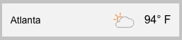

# Weather Widget Assembler at Edge using EdgeWorker

## Use case
Traditionally, weather widgets, which have been useful for site visitors to know their current weather conditions, are rendered as part of HTML content generation at Origin or lazy-loaded via XMLHttpRequest from the browser after the initial page is rendered. While these solution works, both solutions and pro's and con's. To maximize the benefits from both, this solution was born, by pre-populating weather widget contents into highly, globally distributed database and pulling them at the Edge to assemble the final site content for the users. In short, the solution provides fast page load time while optimizing SEO.

## How it works

The following diagram depicts how the solution works at a high level. It uses Akamai EdgeWorkers to fetch the page content and replaces `<weathedr:widget />` tags with actual weather widget HTML snippets that are already populated in EdgeKV database.


By simply passing `db=hp` as a query parameter to the target page, the EdgeWorkers function can pull weather widget snippets from HarperDB, for example, `https://your-site-domain.com/pagename.html?db=hp`. 


The page content needs to include two things: 
* A reference to `weather.css` file
* Weather widget snippets: `<weather:widget locationid="{109-c}" unit="{f|c}" [dynamic] />, where `dynamic` attribute is optional

A look and feel of the widgets can be changed, by wrapping them with a `<div>` container with certain CSS rules. For example, the following code will result::

```
<div class="weather-widget white">
   <weather:widget locationid="141-c" unit="f" [dynamic] />
</div>
```


where as, setting the CSS rule name to `gray` will result in:



This source code repository contains code for: 

* Data updater, shell scripts in the `uploader` directory 
* EdgeWorkers function `main.js` and `HTMLStream.js` in the `services` directory
* Azure DevOps CI/CD pipeline for deploying EdgeWorkers function to Akamai network

There is also a functionality to pass in the locationKey as part of query parameters. When passing in `key={locationKey}` and marking the widget with `dynamic`, the widget will use the locationKey in the query parameters. For example, the request to `https://your-site-domain.com/pagename.html?key=109-c` will use the locationKy 109-c for rendering the widget `<weather:widget locationid="" unit="" dynamic />`.

## How to run it
The following things are needed in order to run the solution:

* Web server hosting the page content (Origin)
* Akamai Delivery Contract containing EdgeWorkers and EdgeKV
* HarperDB account and Akamai Linode account, if needed
* Azure DevOps account, if needed

## Demo page
A demo page can be accessed at: [https://cars.edgecloud9.com/news/?key=112-f](https://cars.edgecloud9.com/news/?key=112-f)

## Additonal resources
Other use cases and examples can be found in the [github repository](https://github.com/akamai/edgeworkers-examples).

* [EdgeKV Documentation](https://techdocs.akamai.com/edgekv/docs)
* [EdgeWorkers Documentation](https://techdocs.akamai.com/edgeworkers/docs)
* [EdgeWorkers API Reference](https://techdocs.akamai.com/edgeworkers/reference/api)
* [Akamai CLI for EdgeWorkers/EKV](https://developer.akamai.com/legacy/cli/packages/edgeworkers.html)
* [EdgeWorkers Developer Page](https://developer.akamai.com/edgeworkers)
* [HarperDB Getting started guide](https://docs.harperdb.io/docs/getting-started)